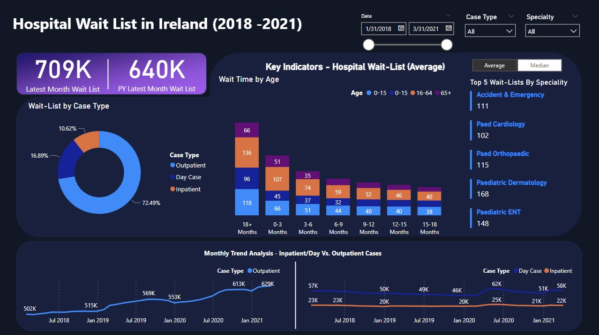

# Hospital Wait Lists Analysis in Ireland

[Fullscreen View](https://raw.githubusercontent.com/ataunque/hospital_waitlist_dashboard/main/wait_list_dashboard.jpg) 
## Project Description

Using publicly available data on Inpatient, Day Case and Outpatient hospital waiting lists to shed light on the state of healthcare accessibility in Ireland based on data collected by the [National Treatment Purchase Fund (NTPF)](https://www.ntpf.ie/home/nwld.htm) in accordance with the Department of Health.

### Business Case

The primary objective of this project is to provide a visual representation of hospital wait times in Ireland. By creating insightful visualizations, we aim to:

1. **Highlight Healthcare Accessibility:** Showcase the current state of healthcare accessibility in Ireland by visualizing the number of patients in different waiting list categories.

2. **Identify Trends:** Identify any significant trends or patterns in wait times over the years to help healthcare stakeholders make informed decisions.

3. **Support Policy Making:** Offer data-driven insights to policymakers, healthcare administrators, and researchers to improve the efficiency of healthcare services and reduce patient wait times.

4. **Enhance Transparency:** Foster transparency in healthcare by making this crucial information accessible to the public, enabling patients to better understand the healthcare system.
